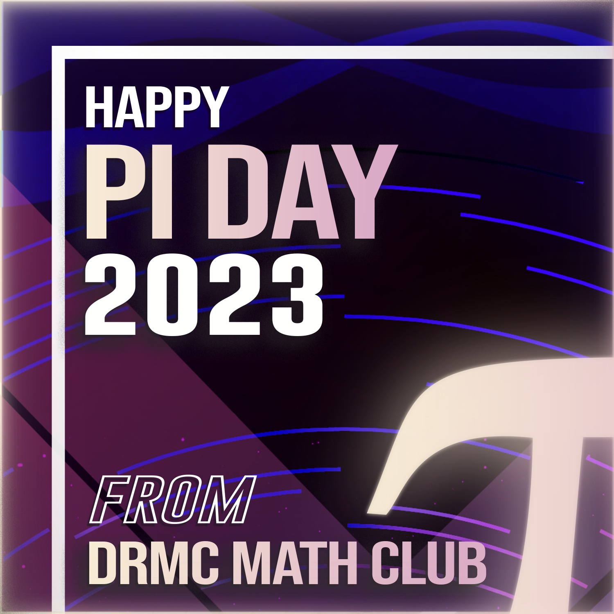
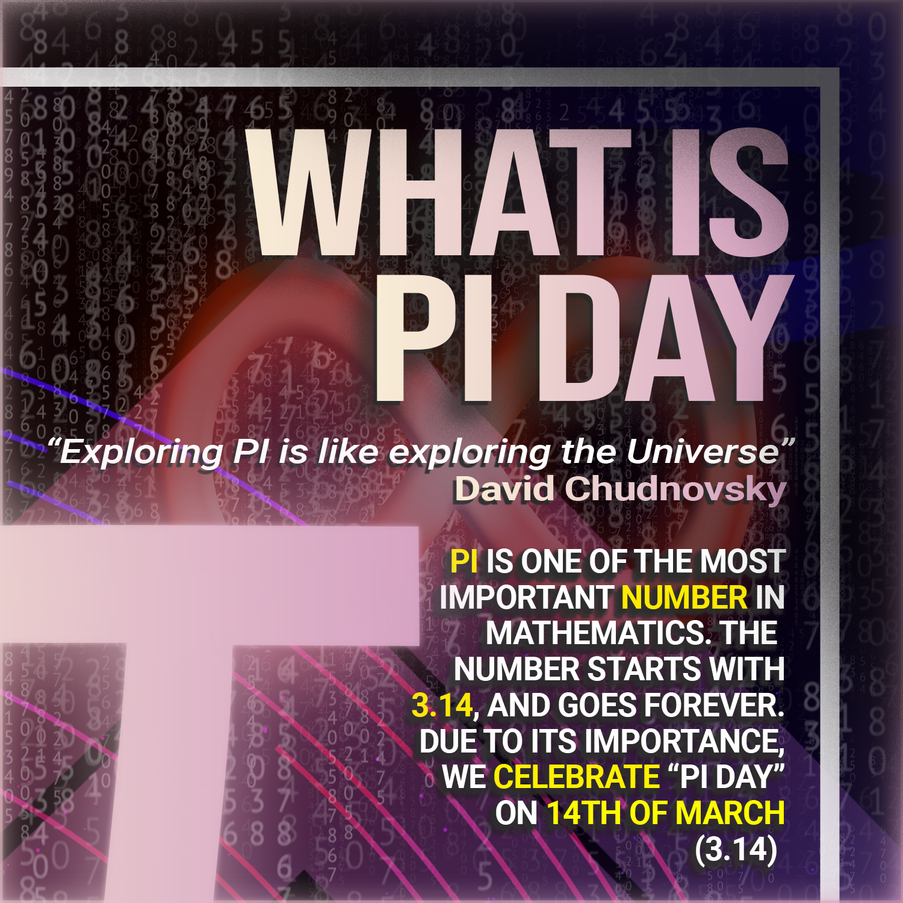
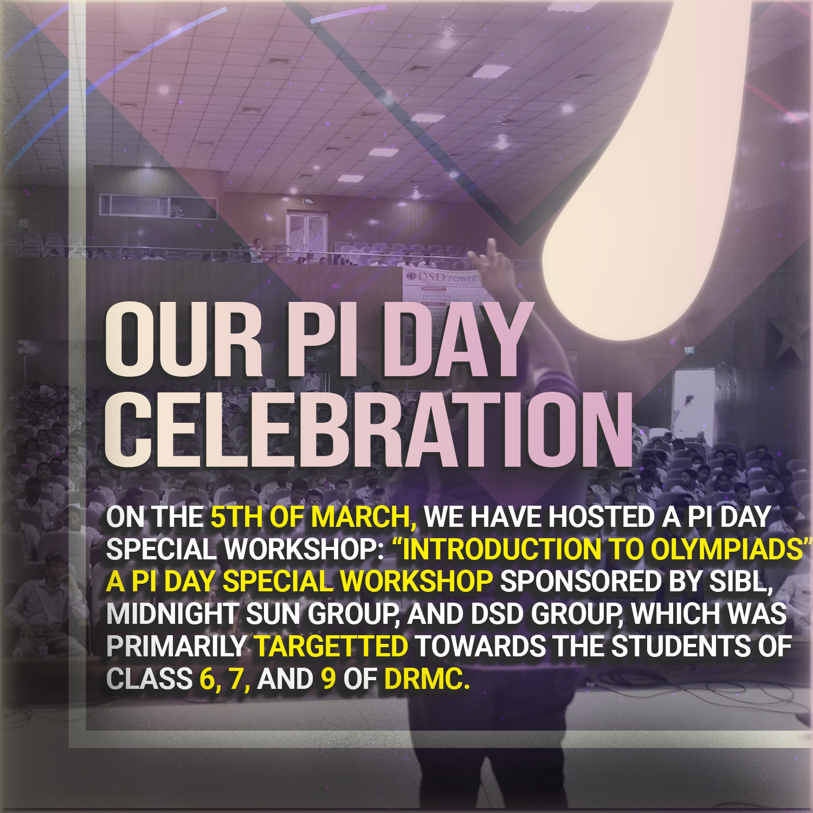

# <b> A COLLECTION OF THE GRAPHICS DESIGNINGS I HAVE DONE AND POSTERS I HAVE MADE THROUGHOUT.</b>
 

From the March of 2023, I have worked actively as a graphics designer on various organizations. This repository contains some of the designs I have preserved and uploaded. Note that these posters are LICENSED under the GPL 3.0 license, meaning that any kind of distributed use of these posters are permitted, albeit no warranties are provided. 

## <b> A poster congratulating DRMC for receiving the "Best Education Award" at the National Level duyring the National Education Week 2023. <b>

 

 

## <b> DRMC MATH CLUB CHESS 500 MEMBERS SPECIAL </b>

 

 

## <b> DRMC MATH CLUB ENVIRONMENT DAY CELEBRATION 2023 POSTER </b>

 

 

## <b> DRMC MATH CLUB CHESS LABOR DAY CELEBRATION 2023 POSTER </b>

 

 

## <b> DRMC MATH CLUB MONTHLY CHESS APRIL 2023 POSTER </b>

 

 

## <b> DRMC MATH CLUB PASCAL BIRTHDAY CELEBRATION POSTER 2023</b>

 

 

## <b> DRMC MATH CLUB MONTHLY CHESS MAY 2023 POSTER </b>

 

 

## <b> DRMC MATH CLUB PI DAY 2023 </b>

 

